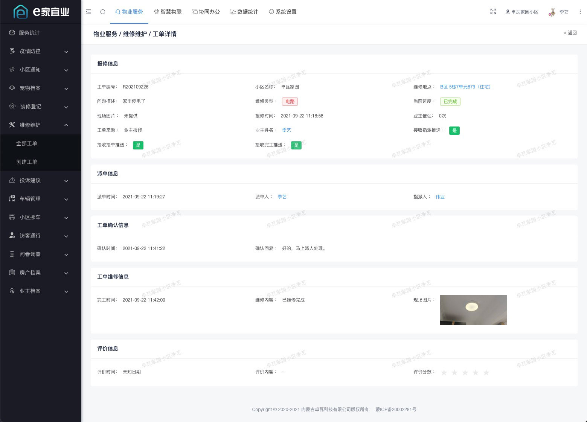
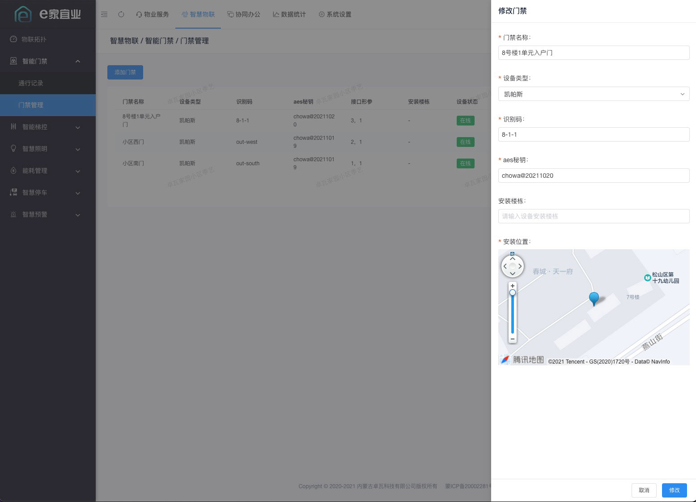
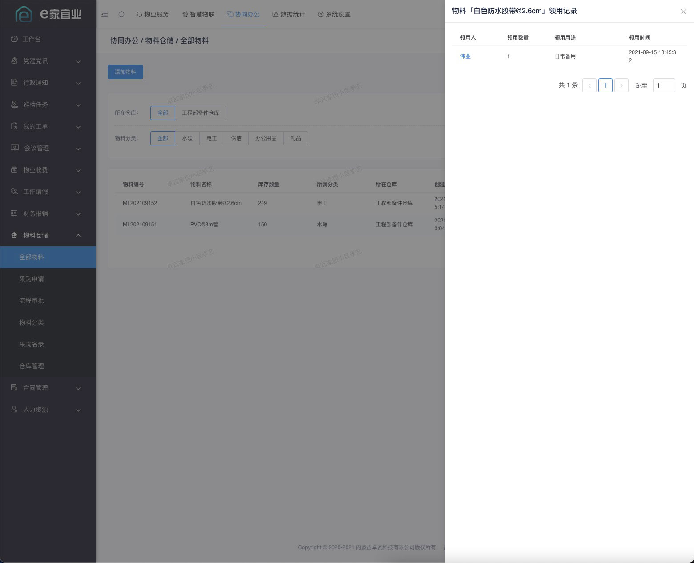
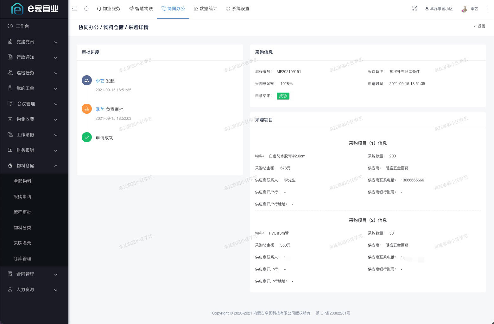
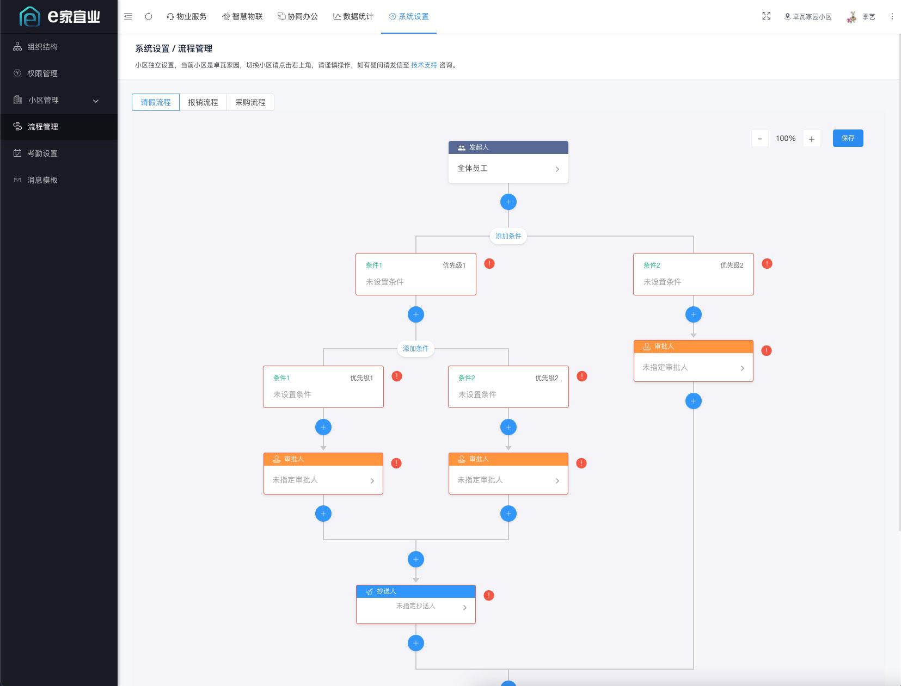
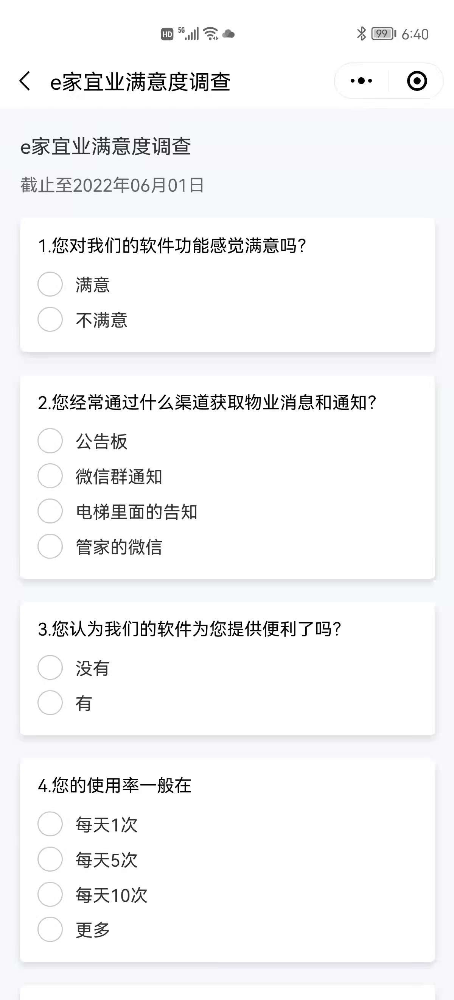
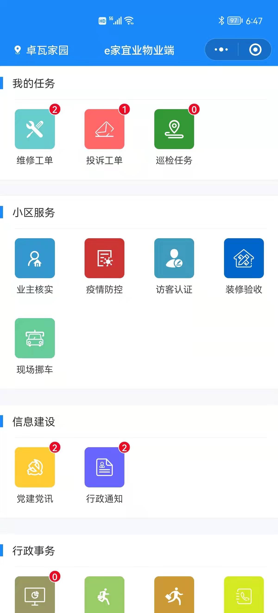
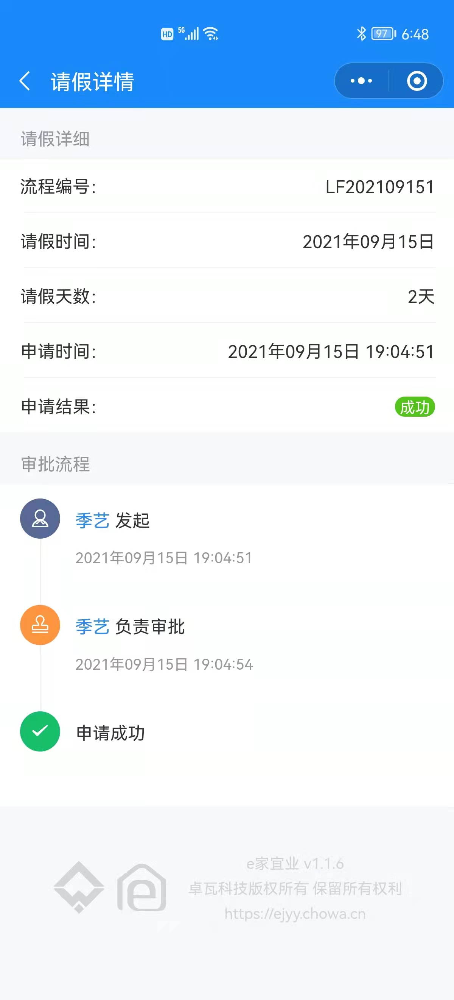
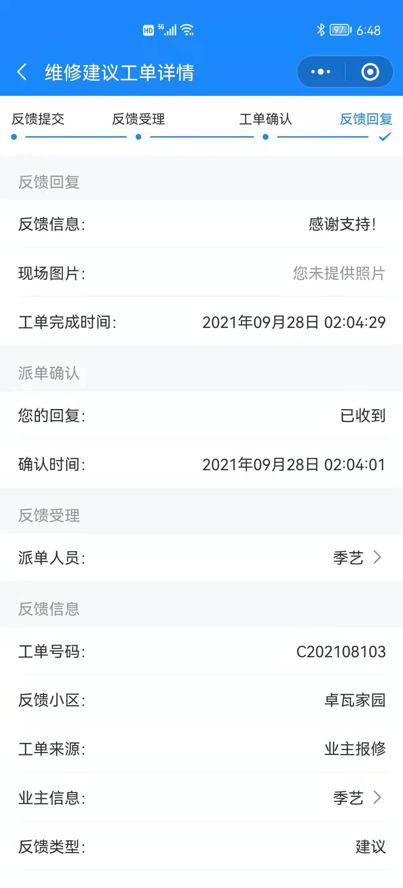

## 项目介绍

「e家宜业」是一套基于AGPL v3开源协议开源的智慧物业解决方案。实现了微信公众号、小程序、PC、H5、智能硬件多端打通。 后端采用Koa + Typescript轻量级构建，支持分布式部署；前端使用vue + view-design开发。

> 禁止将本项目的代码和资源进行任何形式的出售和盈利，产生的一切后果由侵权者自负！！

## 产品展示

### web中台









### 业主端小程序

<p align="center" >





</p>

### 员工端小程序

<p align="center" >




</p>

## 如何部署

[查看文档](https://gj4h0z80f2.feishu.cn/docx/H62ndDuUhodT7dx0QIJc1sMFnfc)

## 自动化开发流水线（automation-kit）

仓库内置了一套可移植的 Claude Code 自动化骨架 [`automation-kit/`](automation-kit/)，把「计划 → 写码 → 测试 → 交付」串成可自动运行的流水线。它是 **monorepo 感知**的：在仓库**根目录**开一个 Claude 会话，同时改前后端时，检查器会从被改文件向上找到所属子项目（`api-server` / `console-web` / `owner-mp` / `property-mp`），自动用那个子项目自己的工具链跑对应检查——无需手写测试命令。

**三个组成部分：**

| 组件 | 作用 | 触发时机 |
|------|------|----------|
| 快速检查 hook | 每次 `Edit`/`Write` 后只检查改动的那个文件（自动定位所属子项目），红了即时反馈给 Claude 自我修正 | `PostToolUse`，自动 |
| 计划/规格模板 | 写码前先产出明确规格 + 人工把关的勾选式任务清单 | 计划模式下，由你填写 |
| `/auto-deliver` 循环 | 遍历所有子项目跑完整门；绿则按逻辑提交并开 PR，红则汇报失败 | `/loop 10m /auto-deliver` |

**安装：**

```bash
# 全局：让 /auto-deliver 与检查器对所有项目可用
./automation-kit/install.sh global

# 本仓库已在根目录装好（.claude/），全栈一个会话即覆盖前后端。
# 重新安装 / 接入其它仓库：
./automation-kit/install.sh project .
```

**各子项目的自动探测关卡：**

| 子项目 | 类型 | 快速档（逐文件） | 完整档（交付门） |
|--------|------|------------------|------------------|
| `api-server` | Koa + TS | `prettier --check` | `tsc --noEmit` 类型检查 ✅ |
| `console-web` | Vue | 本地 `eslint` / `prettier` | `npm test`（暂未配置） |
| `owner-mp` / `property-mp` | 小程序 | `prettier` / `node --check` | 暂无 |

> 说明：前端子项目需先在各自目录 `npm install`，其本地 `eslint`/`prettier` 才会被快速档调用；否则回退到 `node --check` 做语法校验。检查器遇到无法识别的技术栈会安全跳过（exit 0），绝不瞎阻塞。完整用法见 [`automation-kit/README.md`](automation-kit/README.md)。

## License


